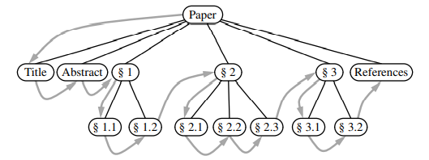
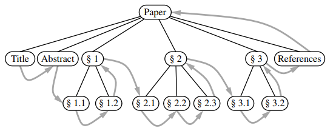
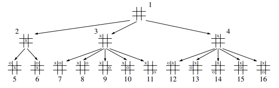
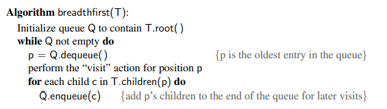
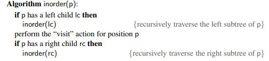
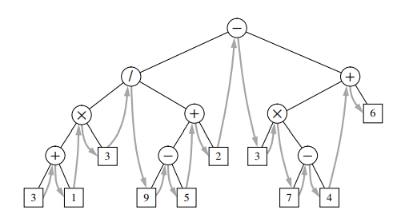
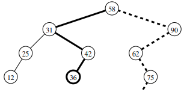
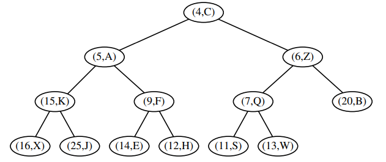

# Python-Office

This repository will store small projects using python. 

In this branch, I will upload some data structure achievement using Python. Also simple Algorithm will be shown here.

## Content

### [0-Git](https://github.com/JinkaiGUAN/Python-Office/tree/DataStructure/0-Git):

This folder store some widely used `git` command. 

### 	[1-Stack_Queues_Deques](https://github.com/JinkaiGUAN/Python-Office/tree/DataStructure/1-Stack_Queues_Deques):

The basic data structure achieved in this folder are as follows:

- stacks: This folder achieved LIFO(last input first output) stacks. Now it only has array-based one.
- queues: This folder achieved FIFO(first input first output) stacks. Noe it only has array-based one.

- deque： We won't achieve this basic data structure since its a built-in data structure. you can use the following code to get it in Python

```python
from collections import deque
```

### [2-LinkedList](https://github.com/JinkaiGUAN/Python-Office/tree/DataStructure/2-LinkedList):

We are going to use linked list to build other kinds of data structure. The content are as follows,

- singly_linkedlist: We achieved stack and queue using singly likedlist, which the time complexity in the wrost case can be `O(1)`, and the space complexity is `O(n)`, where n is the number of elements that the data structure stores.
- circularly_linkedlist: Using singly linkedlist to develop circular Queue.
- doubly_linkedlist: Develop the base doubly linked list.
- positional_list_ADT: Inherent the doubly linked list to build a new list that using position to get the element.

### [3-Trees： Non-linear data structure](https://github.com/JinkaiGUAN/Python-Office/tree/DataStructure/3-Trees)

#### Basic Definitions

- Edge: An edge of tree T is a pair of nodes (u, v) such that u is the parent of v, or vice versa.
- Path: A path of T is a sequence of nodes such that any two o=consecutive nodes in the sequence from an edge

- **Depth**: The depth of p is the number of ancestors of p, excluding p itself.

    - If p is the root, then the depth of p is 0.
    - Otherwise, the depth of p is one plus the depth of the parent of p.

- **Height**: The height of a position p in a tree T is also defined recursively.

    - If p is a leaf, then the height of p is 0.

    - Otherwise, the height of p is one more than the maximum of the heights of p’s children.

        ------

        The height of a nonempty tree T is equal to the maximum of the depths of its leaf positions.

#### Ordered Trees

A tree is ordered if there is a meaningful linear order among the children of each node; that is, we purposefully identify the children of a node as being the first, second, third, and so on. Such an order is usually visualized by arranging siblings left to right, according to their order.

#### Binary Trees

A binary tree is an ordered tree.

- Properties:
    - Every node has at most two children.
    - Each child mode is labelled as being either a **left child** or **right child**.
    - A left child precedes a right child in the order of children of a node.

#### Recursive Binary Tree

- A node r, called the root of T, that stores an element.
- A binary tree (possibly empty), called the left subtree of T.
- A binary tree (possibly empty), called the right subtree of T.

#### Tree Traversal Algorithms

A **traversal** of a tree T is a systematic way of accessing, or ‘visiting’, all the positions of T.

------

1. **Preorder and Postorder Traversals of General Trees**

    - **Preorder traversal**:

        - Searching order: The root of tree T is visited first and then the subtrees rooted at its children are traversed recursively. If the tree is ordered, then the subtrees are traversed according to the order of the children. 

            

    - **Postorder traversal**:

        - In some sense, this algorithm can be viewed as the opposite of the preorder traversal, because it recursively traverses the subtrees rooted at the children of the root first, and then visits the root. 

            

2. **Breadth-First Tree Traversal**

    This approach is to traverse a tree so that we visit all the positions at the depth `d` before we visit the positions at depth `d+1`. Such an algorithm is known as a **breadth-first traversal** , also known as **BFS (breadth-first searching)**.

    


​		The algorithm is as follow:

​			

​		The time complexity of this algorithm is $O(n)$, due to the n calls to enqueue and n calls to dequeue.

3. **Inorder Traversal of a Binary Tree**

    Indeed, for every position p, the inorder traversal visits p after all the positions in the left subtree of p and before all the positions in the right subtree of p.

    

    

    ---

    **Binary Search Tree**

    A binary search tree for S is a binary tree T such that, for each position p of T:

    - Position p stores an element of S, denotes as $e(p)$.

    - Elements stored in the left subtree of p (if any) are less than e(p).

    - Elements stored in the right subtree of p (if any) are greater than e(p)

        

    ****


### [4-PriorityQueues]

#### Priority Queue

Priority queue is a collection of prioritized elements that allows arbitrary element insertion, and allows the removal of the element that has first priority. When the element is added to a priority queue, the user designates its priority by providing and associated **key**.

#### Heaps

 This data structure allows us to perform both insertions and removals in logarithmic time.

A heap is a binary tree T that stores a collection of items at its positions and that satisfies two additional properties: a relational property defined in terms of the way keys are stored in T and a structural property defined in terms of the shape of T itself. 

**Heap-order Property** : In a heap T, for a given position p other than the root, the key stored at p is greater than or equal to the key stored at p’s parent.

 

**Complete Binary Tree Property**: A heap T with height h is a **complete** binary tree if levels 0, 1, 2, …, h-1 of T have the maximum number of nodes possible and the remaining nodes at level h reside in the leftmost possible positions at that level. (The above figure is also a complete binary tree.)

**Height**: for a given complete binary tree, we have, 
$$
h = \lfloor \log n \rfloor
$$

### [5-Maps_HashTables_SkipLists]

#### Maps and Dictionaries


